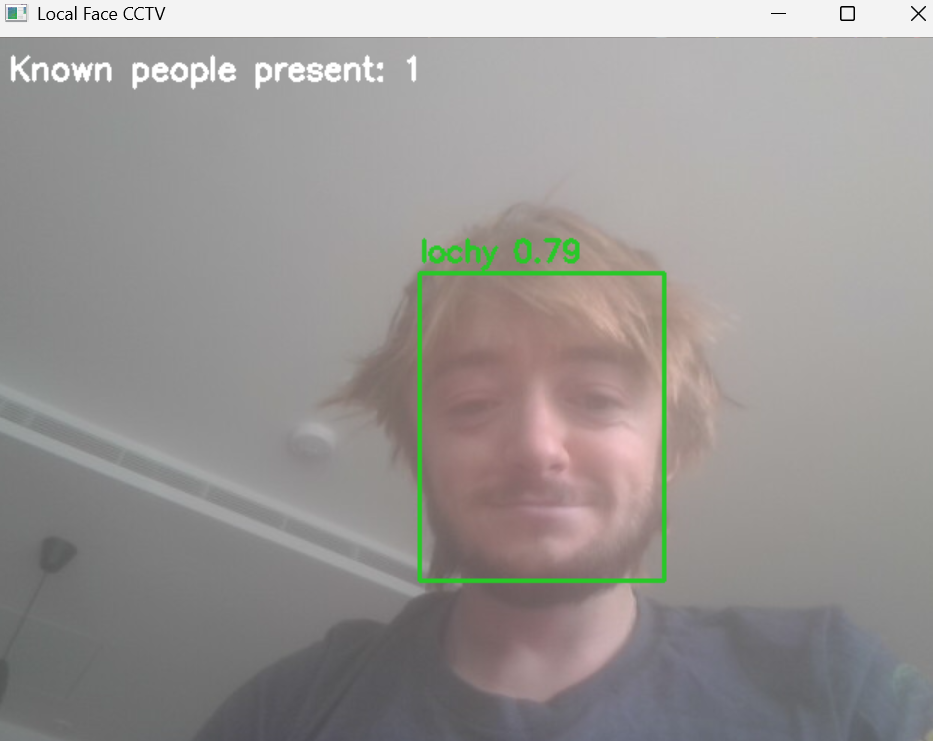

# Local face CCTV prototype


This prototype recognises people who have explicitly been enrolled, records their
presence locally, and generates an HTML activity report. Unknown faces are shown
on screen but are not stored or logged.

Face embeddings are biometric data. Only enrol people with their permission,
protect the `cctv_data` directory, and delete data when it is no longer needed.

https://github.com/FoundationVision/ByteTrack
https://github.com/opencv/opencv_zoo/tree/main/models/object_detection_nanodet


## Setup

TDLR
py -3.13 -m venv .cctv-venv
.\.cctv-venv\Scripts\Activate.ps1
python -m pip install -r requirements.txt
.\download_face_models.ps1

python face_cctv.py enroll --name "Your Name"
python face_cctv.py run
python face_cctv.py report

If youre using an external camera plugged into a computer use

python face_cctv.py run --camera 1

python face_cctv.py enroll --name "Your Name" --camera 1

The existing `.venv` is currently broken because its original Microsoft Store
Python installation is inaccessible. Install or repair Python 3.11+ first, then
open PowerShell in this folder and run:

```powershell
py -3.13 -m venv .cctv-venv
.\.cctv-venv\Scripts\Activate.ps1
python -m pip install -r requirements.txt
.\download_face_models.ps1
```

## Use

Enrol one consenting person (capture from several head angles):

```powershell
python face_cctv.py enroll --name "Alice"
```

Start recognition and presence logging:

```powershell
python face_cctv.py run
```

Press `Q` or Escape to stop. Then generate the report:

```powershell
python face_cctv.py report
```

Open `cctv_data/report.html` in a browser. Other useful commands are:

```powershell
python face_cctv.py list
python face_cctv.py remove --name "Alice"
```

The next stage is to connect these identities to NanoDet person boxes and add
anonymous people counting when no recognisable face is visible.
